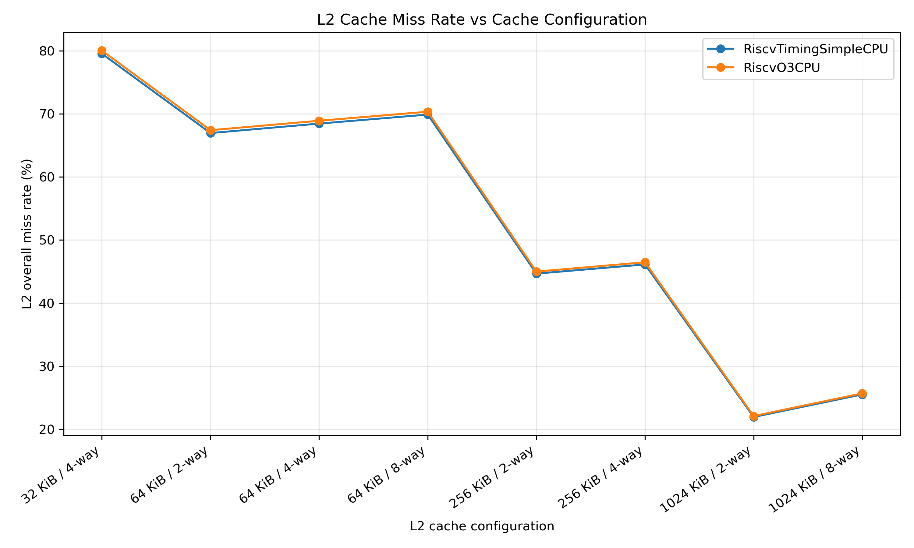
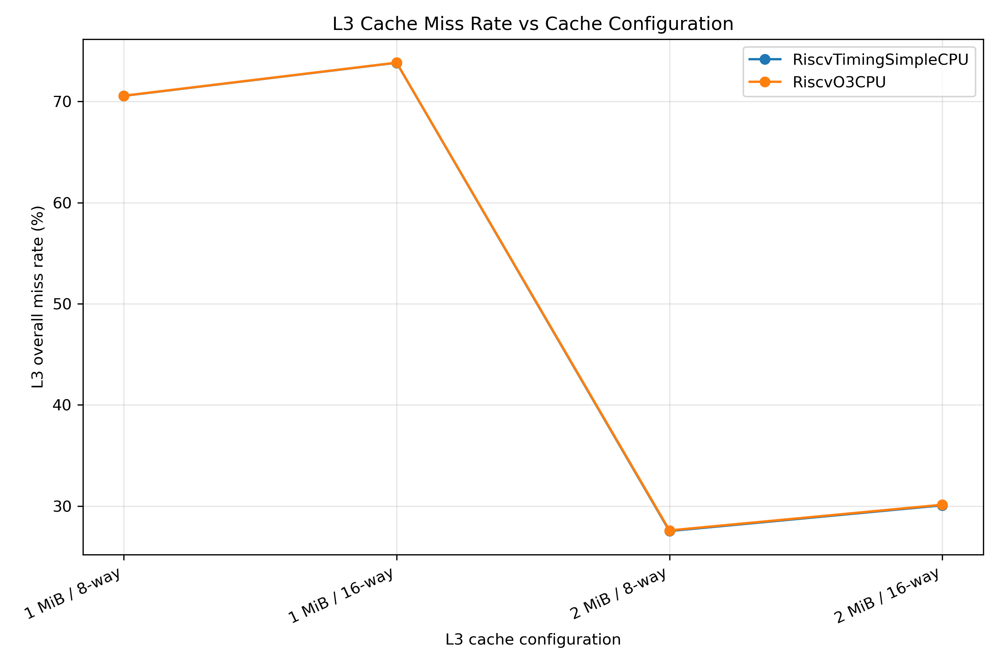

# Computer Architecture (CSE/ECE 511)
## Assignment 1

Eshaan Garg
2024208 

---

# 1. Experimental Setup

- Simulator: gem5 25.1.0.1
- ISA: RISC-V
- Simulation mode: System-call Emulation (SE)
- Benchmark: MiBench `qsort_large`
- CPU models:
  - `RiscvTimingSimpleCPU`
  - `RiscvO3CPU`

## Baseline Cache Hierarchy

| Cache | Size | Associativity | Latency |
|---|---:|---:|---:|
| L1 Instruction | 16 KiB | 2-way | 2 |
| L1 Data | 16 KiB | 2-way | 2 |
| L2 | 512 KiB | 4-way | 10 |
| L3 | 1 MiB | 8-way | 20 |

---

# 2. Baseline CPU Results

## Baseline Simulation Ticks

| CPU | Simulation Ticks | L2 Miss Rate | L3 Miss Rate |
| --- | --- | --- | --- |
| RiscvTimingSimpleCPU | 978,000,084,000 | 35.1769% | 70.5563% |
| RiscvO3CPU | 143,552,496,000 | 35.4577% | 70.5698% |

## Initial CPU Comparison

Both CPU models executed the same workload and the same number of
architectural instructions, but RiscvO3CPU completed the baseline
simulation in substantially fewer simulated ticks. TimingSimpleCPU
required 978,000,084,000 ticks, whereas RiscvO3CPU required
143,552,496,000 ticks.

The cache miss rates of the two processors were very similar. Therefore,
the large difference in simulated execution time is primarily due to
the CPU microarchitecture rather than substantially different cache
locality. RiscvTimingSimpleCPU is an in-order timing model that waits
for memory accesses, while RiscvO3CPU models out-of-order execution and
can exploit instruction-level parallelism.

---

# 3. L2 Cache Experiments

During the L2 sweep, the L3 cache was kept fixed at **1 MiB,
8-way**, while the L2 size and associativity were varied.

## L2 Configurations and Results

| CPU | L2 Configuration | L2 Miss Rate | Simulation Ticks |
| --- | --- | --- | --- |
| RiscvTimingSimpleCPU | 32 KiB, 4-way | 79.5396% | 988,153,354,000 |
| RiscvTimingSimpleCPU | 64 KiB, 2-way | 66.9523% | 985,351,940,000 |
| RiscvTimingSimpleCPU | 64 KiB, 4-way | 68.4539% | 985,731,831,000 |
| RiscvTimingSimpleCPU | 64 KiB, 8-way | 69.8810% | 986,043,281,000 |
| RiscvTimingSimpleCPU | 256 KiB, 2-way | 44.6734% | 980,459,759,000 |
| RiscvTimingSimpleCPU | 256 KiB, 4-way | 46.1309% | 980,802,354,000 |
| RiscvTimingSimpleCPU | 1 MiB, 2-way | 21.9476% | 970,045,786,000 |
| RiscvTimingSimpleCPU | 1 MiB, 8-way | 25.5254% | 971,041,566,000 |
| RiscvO3CPU | 32 KiB, 4-way | 80.0230% | 146,229,168,000 |
| RiscvO3CPU | 64 KiB, 2-way | 67.4099% | 145,492,392,000 |
| RiscvO3CPU | 64 KiB, 4-way | 68.9031% | 145,575,128,000 |
| RiscvO3CPU | 64 KiB, 8-way | 70.3346% | 145,621,846,000 |
| RiscvO3CPU | 256 KiB, 2-way | 44.9956% | 144,215,471,000 |
| RiscvO3CPU | 256 KiB, 4-way | 46.4787% | 144,287,806,000 |
| RiscvO3CPU | 1 MiB, 2-way | 22.1036% | 144,641,172,000 |
| RiscvO3CPU | 1 MiB, 8-way | 25.6979% | 144,895,260,000 |

## L2 Cache Miss-Rate Plot

## L2 Observations

Increasing L2 cache capacity produced a strong reduction in L2 miss
rate for both processor models. For RiscvTimingSimpleCPU, the miss rate
decreased from 79.5396% with the 32 KiB, 4-way configuration to
21.9476% with the 1 MiB, 2-way configuration. RiscvO3CPU exhibited
almost the same trend.

Increasing associativity did not monotonically reduce miss rate in the
tested configurations. For example, at 64 KiB the 2-way cache produced
a lower miss rate than the 4-way and 8-way caches for both CPUs.
Therefore, for qsort_large, increasing cache capacity was more
beneficial than increasing associativity within the configurations
tested.

The large decrease in L2 miss rate resulted in a comparatively small
reduction in simulation ticks. This shows that L2 misses are only one
of several contributors to overall processor execution time.

The two CPU models produced nearly overlapping L2 miss-rate curves,
indicating that the dominant L2 behavior was determined by the
workload's memory-access pattern and cache organization rather than the
CPU model.

---

# 4. L3 Cache Experiments

During the L3 sweep, the L2 cache was kept fixed at **512 KiB,
4-way**, while the L3 size and associativity were varied.

## L3 Configurations and Results

| CPU | L3 Configuration | L3 Miss Rate | Simulation Ticks |
| --- | --- | --- | --- |
| RiscvTimingSimpleCPU | 1 MiB, 8-way | 70.5563% | 978,000,084,000 |
| RiscvTimingSimpleCPU | 1 MiB, 16-way | 73.8284% | 978,537,336,000 |
| RiscvTimingSimpleCPU | 2 MiB, 8-way | 27.5278% | 970,015,703,000 |
| RiscvTimingSimpleCPU | 2 MiB, 16-way | 30.0718% | 970,506,091,000 |
| RiscvO3CPU | 1 MiB, 8-way | 70.5698% | 143,552,496,000 |
| RiscvO3CPU | 1 MiB, 16-way | 73.8405% | 143,641,548,000 |
| RiscvO3CPU | 2 MiB, 8-way | 27.5894% | 143,282,605,000 |
| RiscvO3CPU | 2 MiB, 16-way | 30.1315% | 143,705,274,000 |

## L3 Cache Miss-Rate Plot

## L3 Observations

Increasing L3 capacity from 1 MiB to 2 MiB produced a very large
reduction in L3 miss rate. With RiscvTimingSimpleCPU, the 8-way miss
rate decreased from 70.5563% to 27.5278%. RiscvO3CPU showed almost
identical behavior. This indicates that qsort_large benefits
significantly from the additional L3 capacity.

Increasing associativity from 8-way to 16-way did not improve miss
rate in the tested configurations. At both 1 MiB and 2 MiB, the
16-way cache produced a slightly higher miss rate than the corresponding
8-way cache. Thus, for this workload, increasing capacity was much more
effective than increasing associativity.

The L2 miss rate remained essentially unchanged while L3 was varied,
which confirms that the experiment successfully kept the upper cache
configuration fixed.

Although doubling the L3 capacity dramatically reduced its miss rate,
the reduction in total simulation ticks was relatively small. Therefore,
a reduction in lower-level cache miss rate does not necessarily produce
a proportional improvement in overall execution time.

---

# 5. Comparison of CPU Models

RiscvTimingSimpleCPU and RiscvO3CPU executed exactly 305,769,008
instructions during the complete benchmark, demonstrating that both
processors performed the same architectural workload.

Their cache miss-rate trends were also very similar across the L2 and
L3 experiments. However, their simulated execution times differed
substantially. In the baseline configuration, TimingSimpleCPU required
978,000,084,000 ticks while O3CPU required only 143,552,496,000 ticks,
approximately 6.8 times fewer ticks.

This difference arises from the processor microarchitecture.
TimingSimpleCPU executes instructions in order and exposes memory stalls
more directly. RiscvO3CPU models an out-of-order processor that can keep
multiple instructions in flight, schedule ready instructions, perform
register renaming and exploit instruction-level parallelism. Therefore,
similar cache miss rates do not imply similar overall processor
performance.

---

# 6. Region-of-Interest (ROI) Experiment

The ROI contains only the call to `qsort()`.

The statistics-reset/dump markers were placed immediately before and
after the original `qsort()` statement as required.

## Full-Run vs ROI Results

| CPU | Region | Simulation Ticks | Instructions | L2 Miss Rate | L3 Miss Rate |
| --- | --- | --- | --- | --- | --- |
| RiscvTimingSimpleCPU | Full Program | 978,000,084,000 | 305,769,008 | 35.1769% | 70.5563% |
| RiscvTimingSimpleCPU | qsort ROI | 256,858,160,000 | 83,461,430 | 34.2117% | 65.0524% |
| RiscvO3CPU | Full Program | 143,552,496,000 | 305,769,008 | 35.4577% | 70.5698% |
| RiscvO3CPU | qsort ROI | 43,794,447,000 | 83,461,430 | 34.3815% | 65.0360% |

## ROI Observations

The complete benchmark executed 305,769,008 instructions, whereas the
qsort-only ROI executed 83,461,430 instructions. Thus, only about
27.3% of the full-program instructions occurred inside the sorting
operation. The remaining instructions belong to startup, input
processing, data preparation, output and other runtime activity.

The ROI also required substantially fewer simulated ticks. For
RiscvTimingSimpleCPU, the full execution required approximately
978.0 billion ticks while the ROI required approximately 256.9 billion
ticks. For RiscvO3CPU, the corresponding values were approximately
143.6 billion and 43.8 billion ticks.

Cache statistics also changed when only qsort was measured. For
TimingSimpleCPU, the L2 miss rate changed from 35.1769% for the full run
to 34.2117% for the ROI, while the L3 miss rate changed from 70.5563%
to 65.0524%. O3CPU showed almost identical differences.

These results show that startup, input processing, data preparation and
output have different memory-access behavior from the sorting operation.
Using the dump/reset markers immediately around qsort therefore gives a
more representative measurement of the architectural behavior of the
sorting computation itself.

Within the ROI, both CPU models executed exactly 83,461,430
instructions and exhibited almost identical cache miss rates. However,
O3CPU still required far fewer simulated ticks, reinforcing that the
main performance difference arises from CPU microarchitecture rather
than substantially different cache locality.

---

# 7. Overall Conclusions

The experiments show that cache capacity had a stronger influence on
qsort_large miss rate than associativity within the tested
configurations. Increasing L2 capacity substantially reduced L2 misses,
while increasing L3 capacity from 1 MiB to 2 MiB produced a particularly
large reduction in L3 misses.

Higher associativity did not monotonically reduce miss rate for this
workload. This result is specific to the tested cache organizations and
qsort_large access pattern and should not be interpreted as a general
claim that higher associativity is detrimental.

Despite large changes in cache miss rates, changes in total simulation
ticks were comparatively modest. Processor performance therefore
depends on more than cache miss rate alone.

RiscvTimingSimpleCPU and RiscvO3CPU showed almost identical cache
miss-rate trends, but O3CPU completed both the complete workload and the
qsort-only ROI in substantially fewer simulated ticks. This demonstrates
the importance of processor microarchitecture and instruction-level
parallelism.

Finally, the ROI experiment showed that full-program statistics contain
a large amount of behavior unrelated to sorting. Isolating the qsort
call produced different instruction counts, execution times and cache
miss rates, demonstrating why region-of-interest measurement is useful
when evaluating a specific computation.
